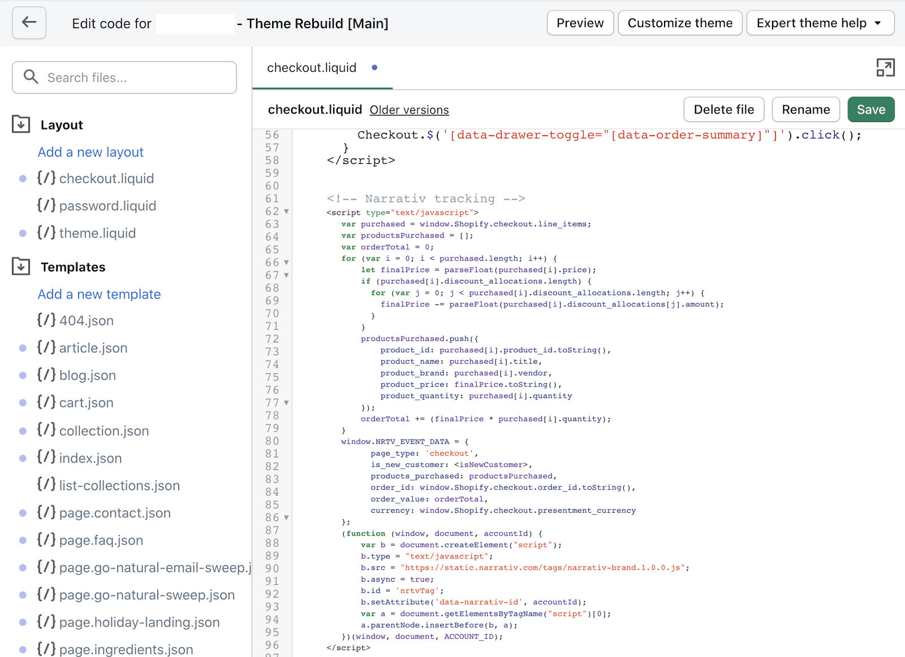

Howl Brand Tag
==================

Overview
--------

The Howl Brand Tag is a lightweight javascript tag that enables partners to maximize their performance and
unlock valuable article and product level insights in a customized dashboard. Only clients with Howl’s Brand Tag
can optimize their campaigns by ROAS and see more comprehensive metrics like revenue and RPC. The tag operates through
two events: page impressions and checkouts.

**Please note:** Both the page impression and checkout events are in compliance with GDPR and CCPA and do not capture
personally identifiable information (PII). Additionally, as the tag runs asynchronously in the background, there is no
impact to the page load time.

Page Impressions
^^^^^^^^^^^^^^^^

Page impression events enable Howl to ensure attribution for our partners. These events should be fired on
every page except pages on the checkout path and the order confirmation page.

Checkouts
^^^^^^^^^

Checkout events allow Howl to accurately capture revenue and conversions in real time. The data gathered by
checkout events also powers an experience creators and publishers rely on to track top sellers and give better product
recommendations in their content. Checkout events should be fired on your site’s order confirmation page, or the
page that loads immediately after they’ve successfully purchased their items.

Adding the Brand Tag
^^^^^^^^^^^^^^^^^^^^

To enable Howl tracking on your site, follow the instruction set that best fits your site setup:

`Web Implementation`_

`Shopify Implementation`_

`Google Tag Manager Implementation`_

Testing the Brand Tag
---------------------

Page Impressions
^^^^^^^^^^^^^^^^

To test the page impression code, filter “bam” in Developer Tools and check for a Fetch/XHR request beginning with
?uid_bam:

Checkouts
^^^^^^^^^

Place an order on your site to test the checkout tag. Similar to the page impression test, be sure to have “bam”
filtered in Developer Tools before you place the order. On the confirmation page, you should see an event fired with
order details in the Request Payload:

**Please note:** We recommend placing an additional test order with a coupon code to ensure the product price variables
accurately capture any discounts.

Web Implementation
---------------------

Page Impression Events
^^^^^^^^^^^^^^^^^^^^^^
Copy and paste the following Javascript snippet in the HEAD section of all site pages, excluding the checkout path
(pages that include PII) and the order confirmation page.

* Make sure to replace ``ACCOUNT ID`` with your own Howl account id.

* Need your Howl account id? Reach out to your growth manager or solutions@planethowl.com for assistance.

::

  

Checkout Events
^^^^^^^^^^^^^^^

Place the following code snippet on your site’s order confirmation page, or the page displayed to customers immediately
after they’ve successfully purchased their items. The code should be populated with order and product purchased details
pertaining to your data layer. Remember to also replace ``ACCOUNT ID`` with your own Howl account id.

**Please note:** to ensure the tag captures discount codes, include logic that checks for the presence of a discount
code and applies it proportionally to the ``product_price`` variable. Discount codes should not be applied to
the ``order_value`` variable.

::

  

Customize the Checkout Code to Your Site
^^^^^^^^^^^^^^^^^^^^^^^^^^^^^^^^^^^^^^^^^

Populate the code snippet based on below requirements:

.. list-table::
   :widths: 1 67 14 18
   :header-rows: 1

   * - Statement
     - Requirement
     - Data Type
     - Notes

   * - ``var purchased = <dataLayerProducts>;``
     - Replace ``<dataLayerProducts>`` with the list of purchased products in your data layer.
       Each item in this array represents attributes of a single purchased product (explained in the following items).
     - Object
     -

   * - ``product_id: purchased[i].<ItemID>,``
     - Replace ``<ItemID>`` with the variable name your data layer uses to define item ID, or the unique identifier
       for the purchased product. This can likely be found in the ``dataLayerProducts`` array described above.
     - String
     -

   * - ``product_name: purchased[i].<ItemName>,``
     - Replace ``<ItemName>`` with the variable name your data layer uses to define item name, or the name
       for the purchased product. This can likely be found in the ``dataLayerProducts`` array described above.
     - String
     -

   * - ``product_price: purchased[i].<ItemPrice>,``
     - Replace ``<ItemPrice>`` with the variable name your data layer uses to define item price, or the *per-unit price*
       of the purchased product. This can likely be found in the ``dataLayerProducts`` array described above.
     - String
     - Both cart level and product level coupon codes should be captured in this variable (e.g. if a coupon code
       variable in the data layer is not null, apply X% discount to ``product_price``)

   * - ``product_quantity: purchased[i].<ItemQuantity>,``
     - Replace ``<ItemQuantity>`` with the variable name your data layer uses to define item quantity, or the quantity
       of the purchased product. This can likely be found in the ``dataLayerProducts`` array described above.
     - Integer
     -

   * - ``product_brand: purchased[i].<ItemBrand>,``
     - Replace ``<ItemBrand>`` with the variable name your data layer used to define item brand, or the brand
       of the purchased product. This can likely be found in the ``dataLayerProducts`` array described above.
     - String
     - If Item Brand is not available, replace ``<ItemBrand>`` with ``null``

   * - ``product_size: purchased[i].<ItemSize>,``
     - Replace ``<ItemSize>`` with the variable name your data layer uses to define item size, or the size
       of the purchased product. This can likely be found in the ``dataLayerProducts`` array described above.
     - String
     - If Item Size is not available, replace ``<ItemSize>`` with ``null``

   * - ``product_color: purchased[i].<ItemColor>,``
     - Replace ``<ItemColor>`` with the variable name your data layer uses to define item color, or the color
       of the purchased product. This can likely be found in the ``dataLayerProducts`` array described above.
     - String
     - If Item Color is not available, replace ``<ItemColor>`` with ``null``

   * - ``orderTotal += (purchased[i].<ItemPrice> *``
       ``purchased[i].<ItemQuantity>);``
     - Replace ``<ItemPrice>`` and ``<ItemQuantity>`` with the same respective values used above.
     - String
     -

   * - ``is_new_customer: <isNewCustomer>,``
     - Replace ``<isNewCustomer>`` with a boolean (true/false) indicating if the order is the customer's first
     - Boolean
     - If field is not available, replace ``<isNewCustomer>`` with ``null``.

   * - ``order_id: <OrderID>,``
     - Replace ``<OrderID>`` with the order ID, a unique identifier for the order.
     - String
     -

   * - ``currency: <CurrencyCode>,``
     - Replace ``<CurrencyCode>`` with the three digit currency code that order was placed in (ex: ‘USD’).
       Uses `ISO 4217`_
     - String
     -

Shopify Implementation
----------------------

You may reference the following examples for implementing the tag on your Shopify site, but you may also roll your own
implementation as long as it meets the requirements.

Page Impression Events
^^^^^^^^^^^^^^^^^^^^^^
On your Shopify home page, navigate to the **Edit code** option in the **Themes** section:

Copy and paste the following Javascript snippet into the ``<head>`` tag of the ``theme.liquid`` layout (pictured below
the snippet) and save your changes.

* Make sure to replace ``ACCOUNT ID`` with your own Howl account id.

* Need your Howl account id? Reach out to your growth manager or solutions@planethowl.com for assistance.

::

    

Checkout Events
^^^^^^^^^^^^^^^
**Shopify Plus Example**

Follow this section if your store is using Shopify Plus.

In the same code editing view as the page impression implementation, place the following code snippet into the
``checkout.liquid`` layout (pictured below the snippet) and save your changes.

* Replace ``is_new_customer: <isNewCustomer>,`` with a boolean (true/false) indicating if the order is the customer’s first. If field is not available, replace ``<isNewCustomer>`` with ``null``.
* Remember to also replace ``ACCOUNT ID`` with your own Howl account id.

**Please note:** to ensure the tag captures discount codes, include logic that checks for the presence of a discount
code and applies it proportionally to the ``product_price`` variable. Discount codes should not be applied to the
``order_value`` variable.

::

    

**Shopify Example**

Follow this section if your store is not using Shopify Plus.

Add a custom code snippet on your site’s order confirmation page, or the page displayed to customers immediately after
they’ve successfully purchased their items. You can do this by navigating to ``Settings > Checkouts and accounts`` on
your Shopify admin page.

Make sure to update ACCOUNT_ID with the Howl’s merch id. Do not add scripts to both sections unless directed to do so.

If the redirect after a customer successfully purchases a product is the order confirmation page, add the below script
to the Order status page additional scripts section.

::

    

If the redirect after a customer successfully purchases a product is the post purchase page, add the below script
to the Post-purchase page additional scripts section.

::

    

Google Tag Manager Implementation
---------------------------------
Page Impression Events
^^^^^^^^^^^^^^^^^^^^^^
Create a new tag titled **Howl Impression Events** with a Custom HTML configuration:

Copy and paste the following Javascript snippet in the HTML field (pictured below the snippet).

* Make sure to replace ``ACCOUNT ID`` with your own Howl account id.

* Need your Howl account id? Reach out to your growth manager or solutions@planethowl.com for assistance.

::

  

Select “All Pages” as the correct trigger for these events, with an exception added for the “Checkout Page”, and
save your changes.

If you don’t already have a trigger for checkout pages, create a new trigger with the settings that pertain to your
site (potential options pictured below).

Checkout Events
^^^^^^^^^^^^^^^
Create a second tag with a Custom HTML configuration titled **Howl Checkout Tag**. Copy and paste the following
Javascript snippet in the HTML field (pictured below the snippet). Remember to also replace ``ACCOUNT ID`` with your
own Howl account id.

**Please note**:

* To ensure the tag captures discount codes, include logic that checks for the presence of a discount code and applies it proportionally to the ``product_price`` variable. Discount codes should not be applied to the ``order_value`` variable.

* ``var purchased`` should be set to the data layer variable corresponding to products purchased at checkout. This can be defined independent of GTM variables (see previous screenshot), or it can be found in the **Variables** section of your Tag Manager dashboard. GTM variables referenced in the checkout tag should be wrapped in doubly curly brackets.

::

    

.. image:: _static/pixel_implementation_screenshots/gtm_6.png

Select “Checkout Page” as the correct trigger for these events and save your changes. Publish both the Impression &
Checkout tags to your live environment.

.. _Google category: https://support.google.com/merchants/answer/6324436?hl=en
.. _ISO 4217: https://www.iso.org/iso-4217-currency-codes.html
.. _Web Implementation: https://docs.narrativ.com/en/stable/tagbrand.html#web-implementation
.. _Shopify Implementation: https://docs.narrativ.com/en/stable/tagbrand.html#shopify-implementation
.. _Google Tag Manager Implementation: https://docs.narrativ.com/en/stable/tagbrand.html#google-tag-manager-implementation
