Narrativ Advertiser Tag
====================================

Functionality
------------

The Narrativ advertiser tag allows Narrativ to track user behavior on an advertiser's site. Our AI optimizes
Narrativ's auction system by looking at data on page views and purchase behavior. Any other PII that is
captured, such as names, email addresses, etc. will be hashed and never stored in plain text. The tag runs
asynchronously in the background so there is no impact to page load times.

Implementation
------------

We track two types of events for our partners - check outs and page views

* Place the check out tag on the page that loads after your customer has finished shopping and paid
  for their purchase (your site's equivalent of a "Thank you for your order" page).

* Place the page view tag on every other page that loads during your user's journey, so that we can
  empower you with data on what products they are looking at before they check out.
  Important! Replace "ACCOUNT NAME" with your Narrativ account name in all snippets. Reach out to
  hello@narrativ.com for help with your Narrativ account name as needed.

Adding Information About Your Checkout Page
------------

For checkout events, you have to fill in some information about the checkout before loading our Javascript. This is
done by inserting the relevant data into a variable called window.BAMX_EVENT_DATA. If a field is optional, you can
just leave it out if you choose not to include the data.

*window.BAMX_EVENT_DATA*

.. list-table::
   :widths: 30 10 60
   :header-rows: 1

   * - Field Name
     - Type
     - Description

   * - user_email
     - string
     - Optional. The user's email address (this will be hashed before being stored - Narrativ does not store PII)

   * - page_type
     - string
     - Required. Must be "checkout" to tell the tag to fire a checkout event.

   * - user_id
     - string
     - Optional. The ID the user has in your system, if available.

   * - order_id
     - string
     - Required. The unique order_id for the checkout that just completed.

   * - order_value
     - float
     - Required. The total purchase price of the order.

   * - currency
     - string
     - Required. The three digit code for the currency that order_value is in (ex: 'USD'). Uses `ISO 4217`_

   * - products_purchased
     - array
     - Required. An array of Product objects representing the purchased items, as defined below.

*Product*

.. list-table::
   :widths: 30 10 60
   :header-rows: 1

   * - Field Name
     - Type
     - Description

   * - product_id
     - string
     - Required. The unique identifier for this product.

   * - product_name
     - string
     - Required. The name of the product.

   * - product_category
     - string
     - Optional. The `Google category`_ of the product.

   * - product_price
     - float
     - Required. The price of the product

   * - product_quantity
     - integer
     - Required. The number of this product purchased in this order.

Full Example (remember, replace "ACCOUNT NAME" with your Narrativ account name)

What you see below is just an example. You cannot copy and paste it as is. Insert the check out
information from your own page into our data layer using Javascript before loading the Narrativ tag.

::

    <!-- begin NARRATIV jstag -->
    
    <!-- end NARRATIV jstag -->

Adding Information for the Page View Tag
------------

The page view tag goes on every page except the checkout page. Remember to change "ACCOUNT NAME" to your Narrativ account name.

*window.BAMX_EVENT_DATA*

.. list-table::
   :widths: 30 10 60
   :header-rows: 1

   * - Field Name
     - Type
     - Description

   * - user_email
     - string
     - Optional. The user's email address (this will be hashed before being stored - Narrativ does not store PII)

   * - user_id
     - string
     - Optional. The ID the user has in your system, if available.

What you see below is another example. You cannot copy and paste it as is. Insert the page view
information into our data layer using Javascript before loading the Narrativ tag.

::

    <!-- begin NARRATIV jstag -->
    
    <!-- end NARRATIV jstag -->

Google Tag Manager Walkthrough
------------

Below is a walkthrough for implementing the Narrativ pixel using a "Custom HTML" tag in Google Tag Manger.
Start by navigating to your Google Tag Manager Dashboard.

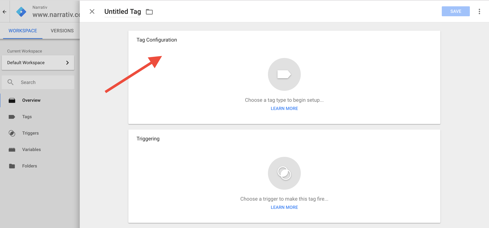

- Select "Tap Configuration" to begin making a new pixel.

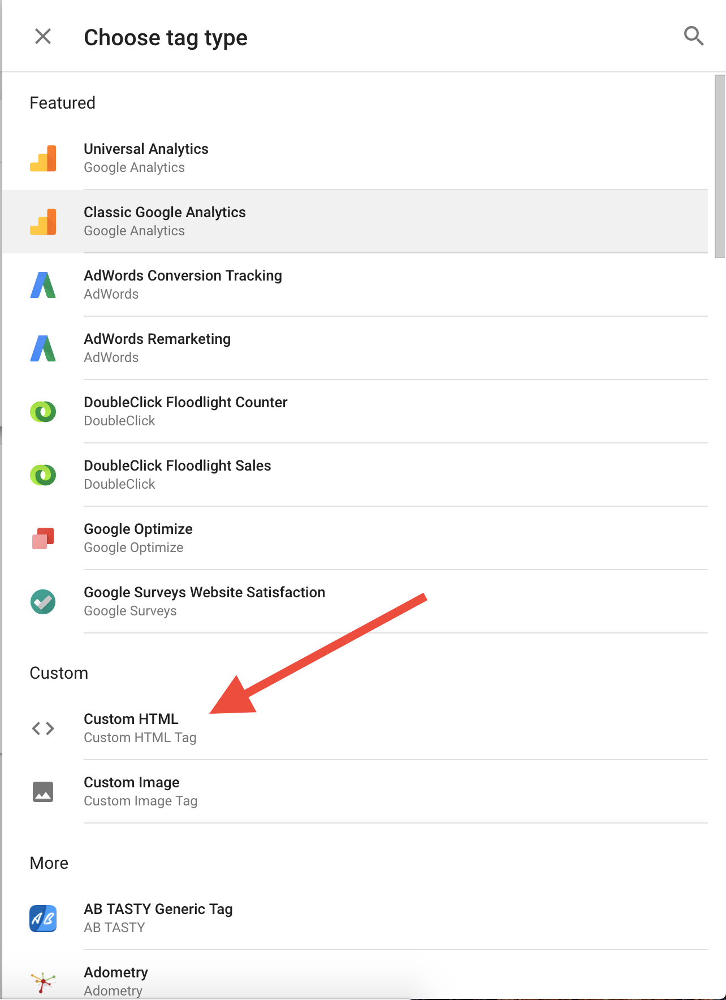

- Select "Custom HTML" to open a text field to copy and paste the above code. Make sure you replace "ACCOUNT NAME" with your Narrativ account name.

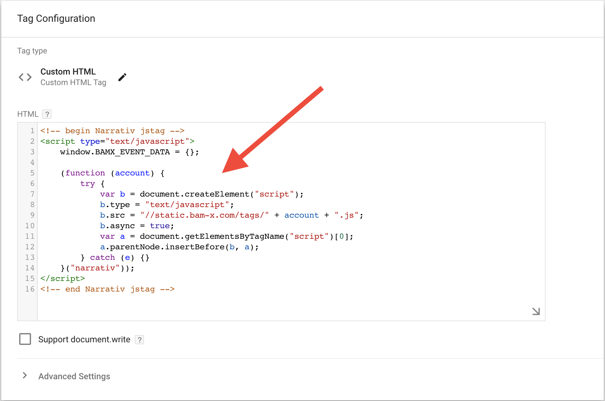

- Enter the code from the "Page View Tag" snippet. Replace the content of "BAMX_EVENT_DATA" with the relevant data from your data layer.

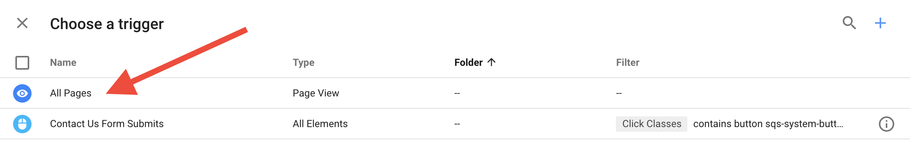

- Select the correct trigger for this "Page View Tag."

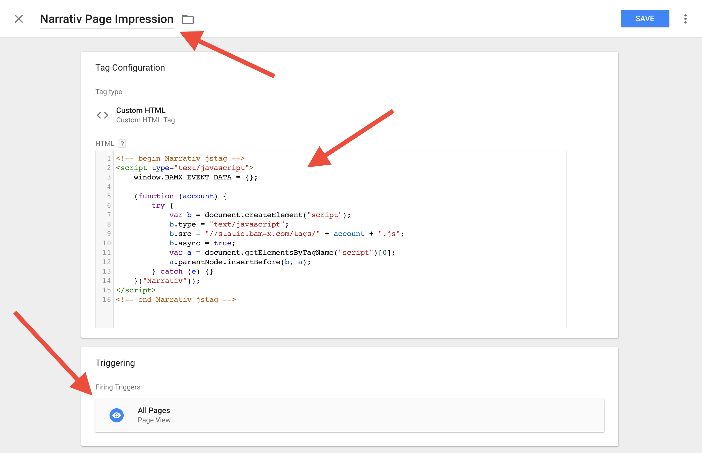

- Make sure the tag is named accurately and has the correct trigger.

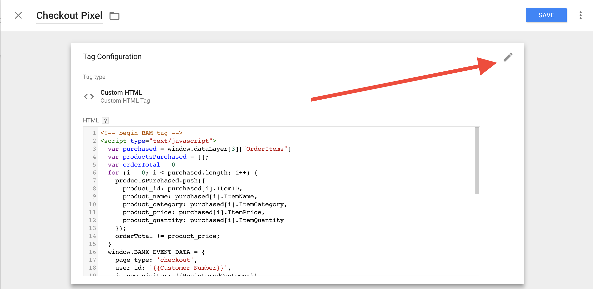

- Create another tag and open the text field.

.. image:: _static/pixel_implementation_screenshots/checkout_3_confirm_code_product_info.png

- This example is using a dummy data layer. You will have to customize “var purchased” to point at how you access the order content in your data layer.

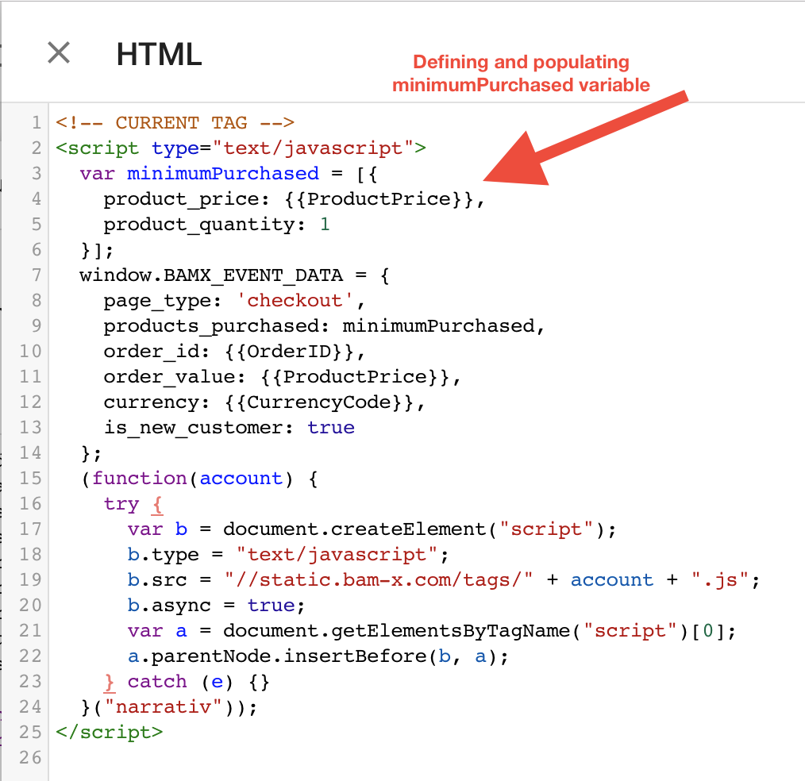

- If you do not have checkout product information available in your data layer then use “var minimumPurchased” instead and set it equal to the price of the checkout.

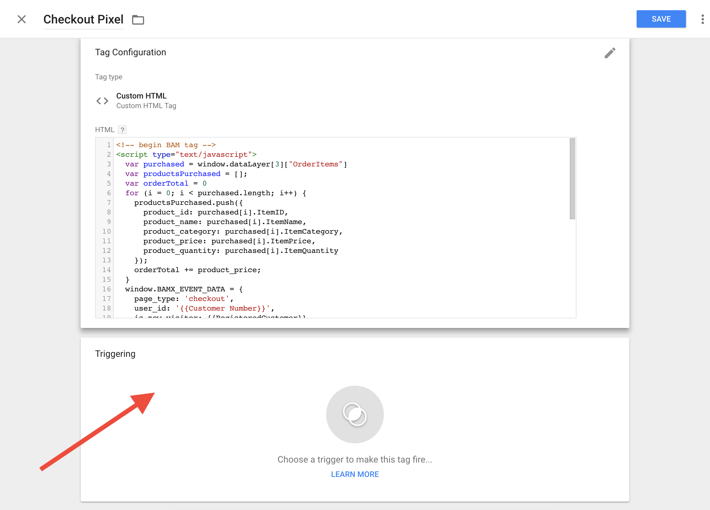

- Add a trigger for this tag.

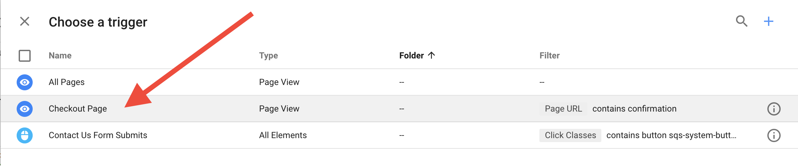

- If you do not have a preset trigger for checkout pages then you will have to create one.

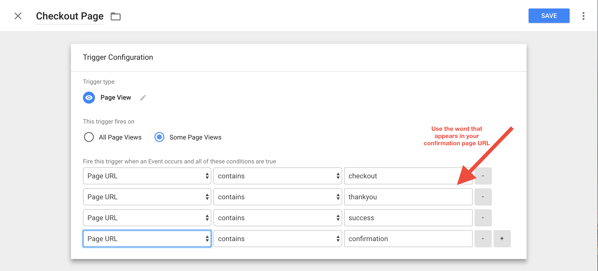

- The above example has a series of triggers based off of common URL types for checkout pages. (ie www.narrativ.com/checkout/ will trigger the top option). Replace checkout with whatever word your site uses on checkout pages. You only need one trigger.

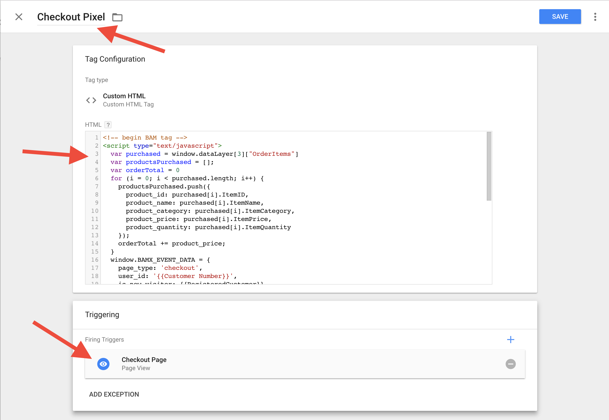

- Double check the name, code, and trigger.

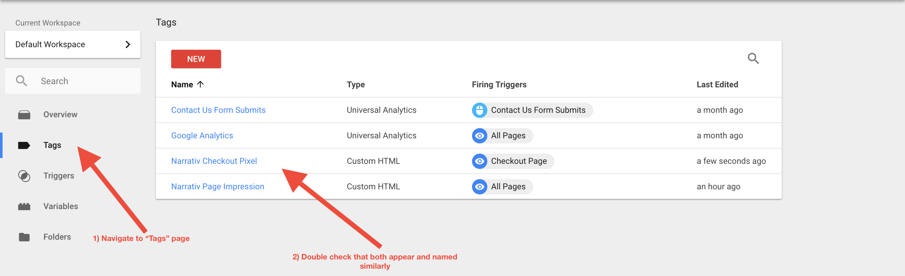

- Make sure that the tag(s) are showing up in the "Tag" tab.

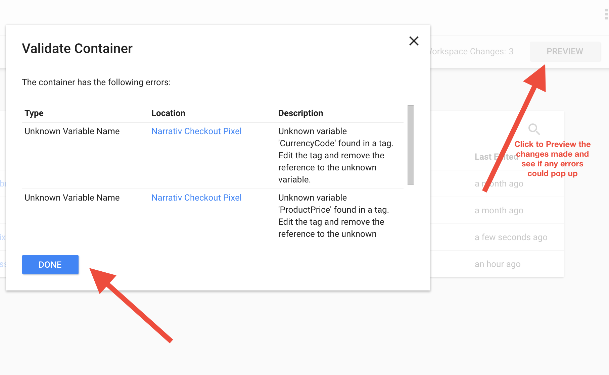

- Preview the changes made and fix any errors that pop up in the window.

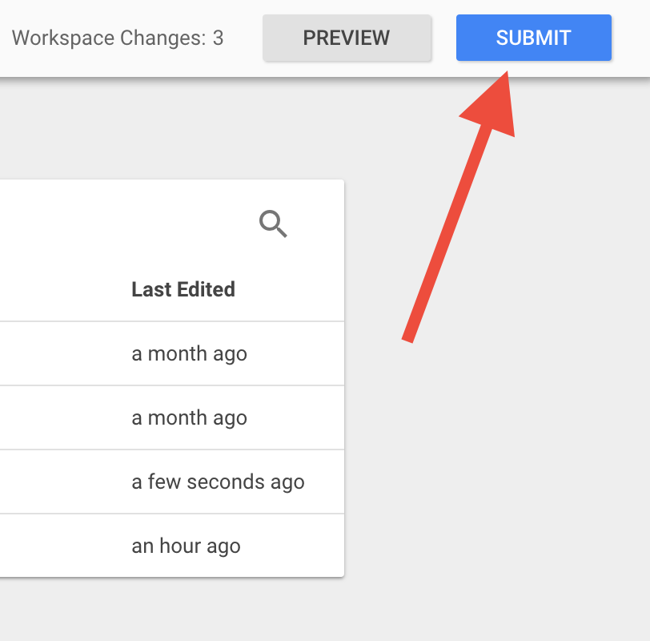

- Submit your changes (this step is not final)

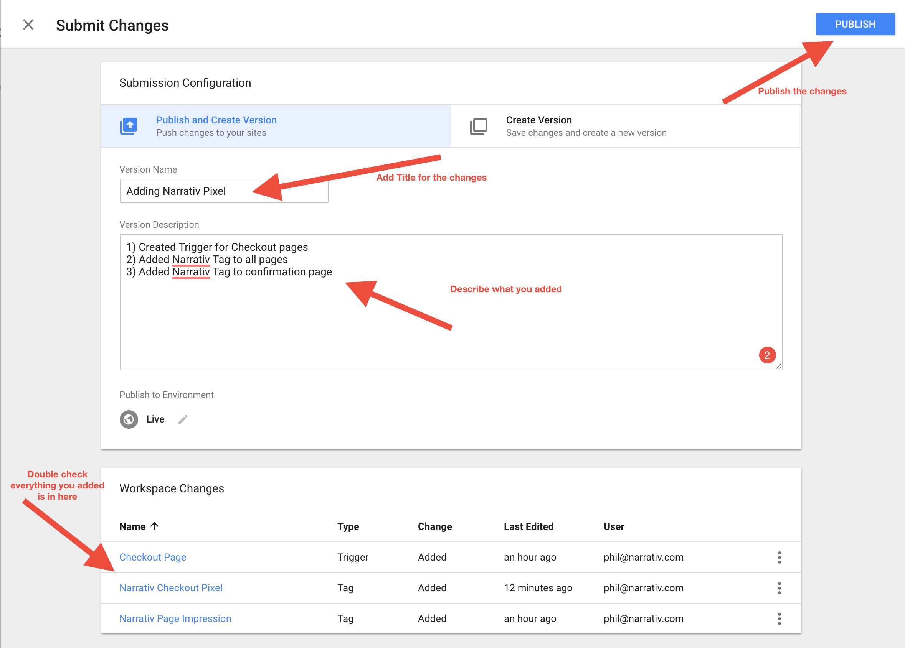

- Double check everything you worked on is in this submission. Name the submission something clear so that you can go back and debug any issues later.

You did it!!

If you have any issues during this process then reach out to your Narrativ contact or hello@narrativ.com

.. _Google category: https://support.google.com/merchants/answer/6324436?hl=en
.. _ISO 4217: https://www.iso.org/iso-4217-currency-codes.html
